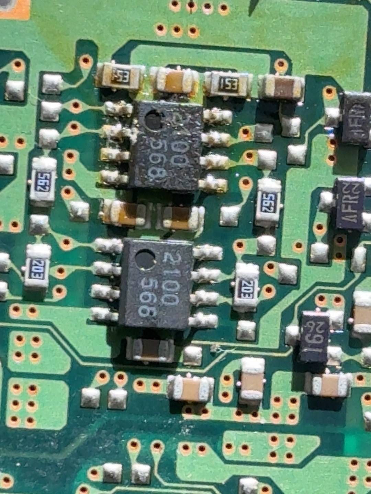
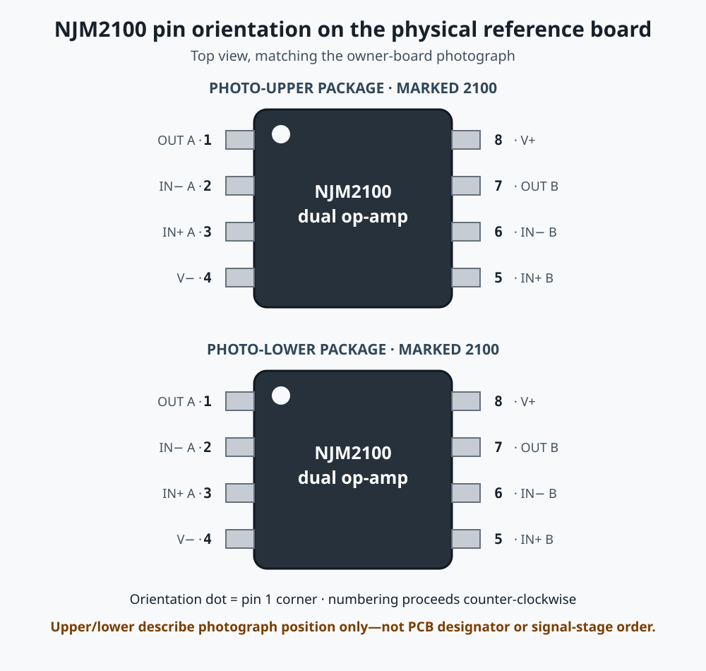

# Early PU-8 audio modelling: architecture review

This document describes a possible modelling boundary for early PlayStation
PU-8 audio. It deliberately presents architecture and pseudocode rather than a
merge proposal. The experimental RTL remains private while the exact target
board lacks coefficient-grade measurements and the feature build remains
timing-constrained.

## Question being investigated

Does an early PU-8 PlayStation impose a repeatable audible transfer function
that should be modelled after the MiSTer PSX SPU output?

The validation target is motherboard `1-658-467-11`, identified from the PCB
and fitted parts rather than the console shell label alone:

```text
CXD2922BQ SPU
  -> AK4310VM 24-pin stereo DAC
  -> coupling/filter/output circuitry
  -> two visible NJM2100 dual op-amp packages
  -> rear RCA and AV Multi-Out
```

The exact stage order, gains and small-signal capacitor network of this board
have not been completely traced or measured. It must not be described as
identical to every SCPH-1001/SCPH-1002 or later PU-8 revision.

## Physical NJM2100 reference and pin orientation

The repository owner's solder-side macro directly shows two packages marked
`2100` on the target board:



Both orientation dots are at the upper-left as the photograph is displayed.
Applying the standard NJM2100 top-view pinout gives:



| Pin | Standard NJM2100 function |
|---:|---|
| 1 | channel A output |
| 2 | channel A inverting input |
| 3 | channel A non-inverting input |
| 4 | negative supply / ground in single-supply use |
| 5 | channel B non-inverting input |
| 6 | channel B inverting input |
| 7 | channel B output |
| 8 | positive supply |

The pin functions and package options are documented by the
[NJM2100 manufacturer product record](https://www.nisshinbo-microdevices.co.jp/en/products/operational-amplifier/spec/?product=njm2100).
“Photo-upper” and “photo-lower” are deliberately positional labels. The crop
does not expose PCB designators, and physical position does not prove which
package is electrically first or whether the two networks are cascaded.

## Evidence hierarchy

| Evidence | What it supports | Applicability limit |
|---|---|---|
| Target-board photographs and meter readings | AK4310VM, two NJM2100 packages, paired approximately 20 kohm and 5.6 kohm resistors | Adjacency and value do not prove complete nets or stage order |
| AKM AK4310 manufacturer material and Pioneer service documentation | 16-bit delta-sigma DAC, 8x interpolation, SCF, pinout, +/-0.02 dB passband ripple and 57 dB stopband | Does not disclose Sony's analogue network or FIR coefficients |
| [Mick Feuerbacher / DogBreath trace](https://dogbreath.de/PS1/output/output.html) | AK4309AVM SCPH-100x RCA branch: inverting NJM2100 stage, coupling, muting, 1 kohm + 100 ohm output string | Comparison board uses AK4309AVM and one NJM2100 package, not the exact AK4310VM `-11` |
| [John Atkinson / Stereophile measurements](https://www.stereophile.com/content/sony-playstation-1-cd-player-measurements) | 1.09 Vrms, approximately 1100 ohm source impedance, 1205 ohm at 20 Hz, RCA inversion and clipping into loads below about 3 kohm | One AK4309AVM-equipped SCPH-1001; frequency response is a graph without raw points |
| Sony SCPH-5500/5501/5502/5503 service manual | PU-18 AK4309A direct path: 10 uF, 1 kohm, mute stage and 100 ohm to AV Multi-Out | Authoritative for PU-18, not the target's two-op-amp RCA branch |
| [Archimago SCPH-5501 measurements](https://archimago.blogspot.com/2013/03/measurements-sony-playstation-1-scph.html) | Slight upper-band response deviation exists on a direct AK4309A AV path; approximately 15-bit practical dynamic range | Graph-only capture through stock cable and E-MU ADC; not AK4310 calibration |
| [PSX-SPX hardware reference](https://problemkaputt.de/psxspx-pinouts-spu-pinouts.htm) | SPU/DAC serial interface and family pin context | Reverse-engineered reference, not a Sony or AKM transfer-function specification |
| Recent community measurement response | PU-8 RCA and AV paths reported broadly linear, sub-decibel low-frequency differences, RCA inversion and no useful harmonic signature | Raw data, board/DAC marking and full method have not yet been supplied |

The DogBreath and Stereophile overlap is particularly useful: a traced
`1 kohm + 100 ohm` output string independently matches the measured `1100 ohm`
source impedance, while the traced inverting RCA branch matches the measured
polarity inversion. This cross-validates those facts for the measured AK4309
reference board. It does not prove that the target AK4310VM board has the same
complete internal network.

## Constraints that can be used

The defensible reference profile is deliberately narrow:

- broadband gain is treated as unity;
- audible-band magnitude is treated as flat until numeric response data exists;
- the coupling envelope is sub-hertz and effectively flat by 20 Hz;
- no harmonic distortion or compression is enabled;
- physical 1100-ohm source impedance is documentation, not a digital filter;
- RCA polarity inversion is an interface fact and does not alter sound once
  both stereo channels are inverted together; and
- ultrasonic DAC reconstruction/noise behaviour is outside a base-rate HDMI
  transfer model unless a specific audible consequence is demonstrated.

An inverse single-RC calculation from Atkinson's impedance magnitudes gives a
useful external constraint, not a component identification:

```text
Rs       = 1100 ohm
|Z20Hz|  = 1205 ohm
Xc       = sqrt(1205^2 - 1100^2) = approximately 492 ohm
Ceff     = 1 / (2*pi*20*492)      = approximately 16.2 uF
```

The physical circuit contains active stages, so `16.2 uF` must not be assigned
to a particular PCB capacitor or treated as proof of a one-pole topology.

## Proposed digital boundary

The model begins with the final signed 16-bit stereo sample committed by the
SPU at 44.1 kHz. `sound_out_tick` is used as a synchronous clock enable; it is
not a new clock.

```text
SPU final PCM L/R
       |
       +----------------------------> Standard direct path
       |
       +----> optional measured-profile envelope
                         |
                    OSD selection
                         |
                    AUDIO_L / AUDIO_R
```

Standard remains a direct bit-exact assignment. The optional path must never
be required for normal core operation.

## Conceptual pseudocode

This pseudocode documents the current research scaffold, not an authenticated
AK4310 transfer function:

```text
constant LEAK_SHIFT     = 15       // approximately 0.21 Hz at 44.1 kHz
constant HEADROOM_SHIFT = 8        // 255/256 attenuation-only guard

function divide_power_of_two_toward_zero(value, shift):
    if value >= 0:
        return value >> shift
    return -((-value) >> shift)

on reset:
    previous_input[L,R] = 0
    highpass_state[L,R] = 0
    experimental_out[L,R] = 0

on sound_out_tick, for each channel:
    x = sign_extend(spu_pcm[channel])

    leak = divide_power_of_two_toward_zero(
        highpass_state[channel], LEAK_SHIFT)

    hp = highpass_state[channel]
         + x
         - previous_input[channel]
         - leak

    guard = divide_power_of_two_toward_zero(hp, HEADROOM_SHIFT)
    y = saturate_to_signed_16(hp - guard)

    previous_input[channel] = x
    highpass_state[channel] = hp
    experimental_out[channel] = y

if osd_mode == STANDARD:
    AUDIO_L/R = spu_pcm[L/R]       // direct bit-exact bypass
else:
    AUDIO_L/R = experimental_out[L/R]
```

The 255/256 term is an implementation safety margin, not a claim about console
gain. It prevents the recursive block's startup transient from manufacturing
clipping. No high-frequency shelf or waveshaper is present because the sources
do not provide numeric evidence for one.

## Verification performed on the scaffold

- Structural integration check confirms the direct Standard bypass.
- Independent integer response analysis covers 20, 50, 100, 1000 and
  20000 Hz full-scale tones with no over-range samples.
- Pinned Icarus Verilog regression covers signed symmetry, output hold, reset,
  disabled nonlinearity and one million randomized clock-enable cycles.
- Quartus 17.0.2 completes and produces an RBF.
- Current fit uses 40,629 / 41,910 ALMs (97%) and all 112 DSP blocks; the audio
  block adds no DSP blocks.
- TimeQuest remains non-clean at `-0.014 ns` setup and `-0.154 ns` hold. Stock
  upstream at the comparison seed also fails timing, but this does not make the
  feature merge-ready.
- A MiSTer smoke test found no obvious tonal difference from Standard, which
  is expected for this almost-transparent profile.

These checks demonstrate arithmetic and integration. They do not establish
conformance with an original AK4310VM console.

## Interpretation

The evidence currently does not support coding a warm, compressed, softened
or otherwise distinctive "audiophile" effect. Published measurements and the
available community report instead point toward a largely transparent
audible-band path. This does not prove that all subjective reports are false,
but it leaves the celebrated character unconfirmed as a repeatable engineering
transfer function.

If future raw measurements show only a small linear response difference, an
external MiSTer audio-filter preset—or no processing—would be preferable to
spending scarce PSX-core logic. Core-side RTL becomes justified only if an
identified board exhibits a stable behaviour that cannot be represented more
appropriately elsewhere.

## Review requested

1. Is the digital modelling boundary above appropriate, or should the core
   remain completely bit-exact?
2. Does anyone have raw magnitude and phase data for an identified early PU-8
   `1-658-467-11` with AK4310VM?
3. Can the existing PU-8 RCA/AV measurements be supplied as CSV, WAV or analyser
   exports with board number, DAC marking, load and loopback calibration?
4. Would a framework audio-filter preset be the accepted MiSTer mechanism for
   any confirmed sub-decibel linear difference?
5. Is there a corroborated exact-board net trace that resolves the two
   NJM2100 stages without transferring the single-stage AK4309 circuit?

Until those questions are answered, this should remain a documented research
scaffold rather than a user-facing authenticity feature.
