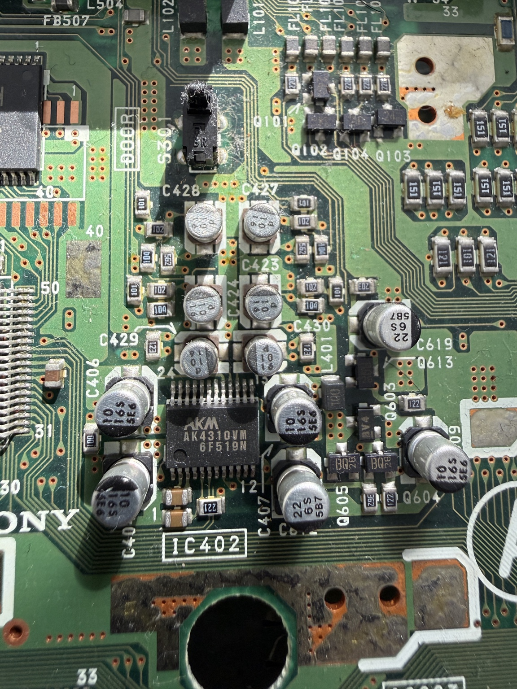

# PS1 Audiophile Audio Research

This project investigates whether early Sony PlayStation PU-8 hardware has a
repeatable "audiophile" audio signature that can be measured and meaningfully
represented on MiSTer FPGA.

The word *audiophile* identifies the claim under investigation. It is not a
claim that this repository has already authenticated a superior or audibly
distinct transfer function.

## Physical reference board

The reference console contains an early PU-8 `1-658-467-11` motherboard. Its
component marking identifies `IC402` as an AKM `AK4310VM` 24-pin stereo DAC.

The photograph is an original image of the repository owner's board. The PNG
contains no EXIF, GPS, camera, author or embedded-text metadata.

## What is published here

- [Architecture review](PU8_AUDIO_ARCHITECTURE_REVIEW.md): evidence hierarchy,
  modelling boundary, conceptual pseudocode, verification already performed,
  and the measurements still required.
- [Board photograph](images/pu8-11-ak4310vm.png): direct visual evidence for
  the target board's AK4310VM DAC.

No Sony manuals, BIOS files, game images, third-party photographs, experimental
RBF binaries or private review archives are included.

## Current finding

The available evidence does not yet support an authenticated warm, compressed,
softened or otherwise distinctive DSP profile. Published measurements of a
related AK4309-equipped SCPH-1001 and the available community evidence instead
suggest a largely transparent audible-band path.

That is a useful engineering result, but it is not the final answer for the
AK4310VM-equipped `1-658-467-11`. Raw, reproducible measurements from an
identified target board remain the calibration gate.

## Contributions wanted

The most valuable contribution is a calibrated comparison of identified
AK4309 and AK4310 consoles using the same signal source, load and capture path.
Please provide raw WAV, CSV or analyser exports together with:

- console model, PCB number and readable DAC marking;
- RCA and AV Multi-Out captures where available;
- magnitude, phase/polarity, noise and THD-versus-level data;
- source/load impedance and connected load;
- audio interface, sample rate and loopback calibration method; and
- unprocessed source and capture files.

Graph screenshots and listening impressions are welcome as context, but they
cannot replace the raw data needed to fit or validate a digital model.

## Relationship to MiSTer

This is an independent research repository and is not an official MiSTer
project or a merge request. Any future MiSTer-derived source published here
will retain the applicable upstream copyright and GPL terms.

## Licence

The original material in this repository is distributed under the GNU General
Public License version 2. See [LICENSE](LICENSE). Third-party works linked from
the review remain under their respective owners' terms and are not relicensed
by this repository.

Sony and PlayStation are trademarks of Sony Group Corporation and/or its
affiliates. This project is not affiliated with or endorsed by Sony.
